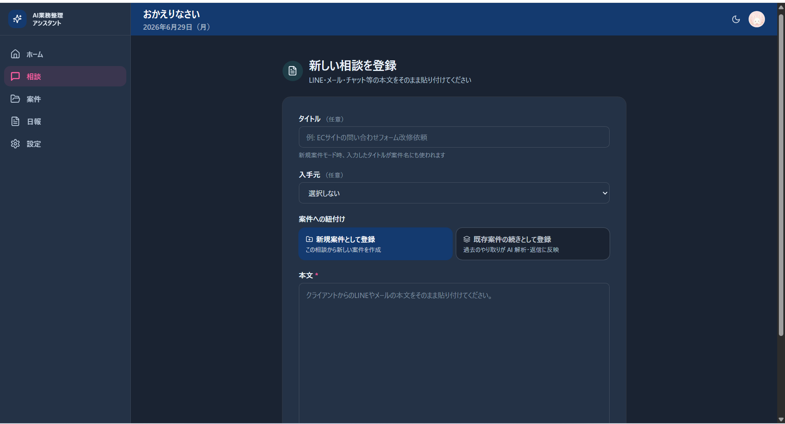
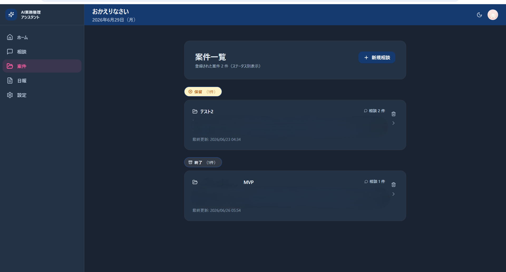
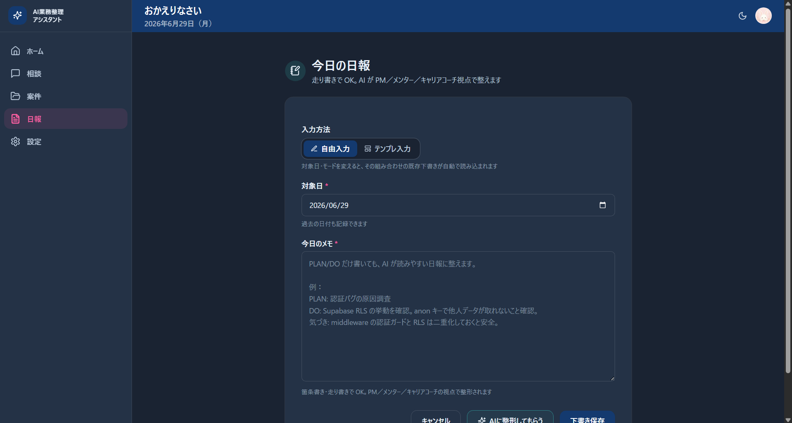
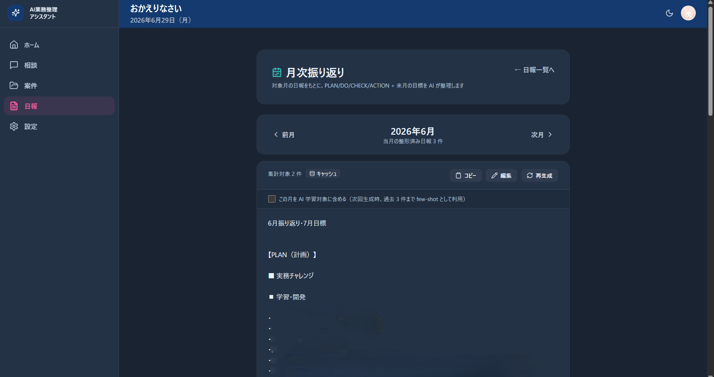
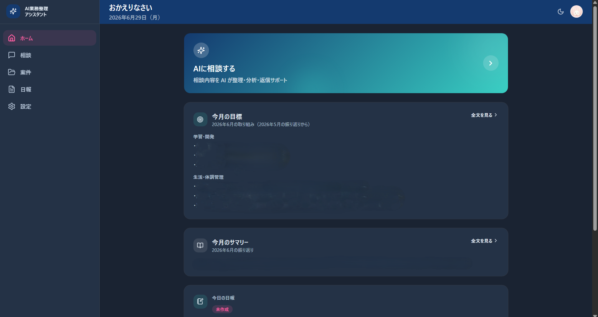
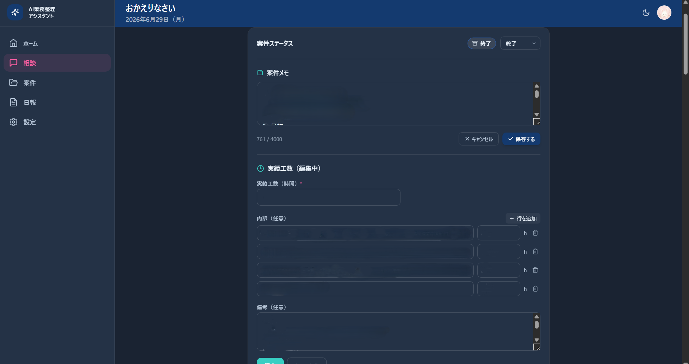

# AI 業務整理アシスタント

> フリーランス・個人事業主が「相談整理 → 受注判断 → 返信文作成 → 日報 → 月次振り返り」までを、AIで一貫して支援する業務支援Webアプリです。

---

# 📌 このリポジトリについて

本リポジトリは **講座課題提出・ポートフォリオ公開用** のリポジトリです。

アプリのコンセプト・設計・画面イメージを紹介することを目的としており、ソースコードの公開や第三者による実行環境の提供は想定していません。

実運用版はプライベートリポジトリで継続開発しています。

---

# アプリ概要

クライアントから届いた相談内容を貼り付けるだけで、

- AIによる相談内容の整理
- 不足情報・確認事項・リスクの抽出
- 返信文の作成支援
- 案件管理
- 日報作成
- 月次振り返り

までを、一つの業務フローとして管理できるWebアプリです。

従来は複数のツールに分散していた業務を、一つの画面で完結できることを目指して設計しました。

---

# 開発背景

フリーランスとして開発業務を進める中で、

- 相談内容の整理
- 返信文作成
- 案件管理
- 日報
- 月次振り返り

が複数ツールに分散し、業務の流れが途切れてしまうことに課題を感じていました。

ChatGPTやClaudeは優秀ですが、その場限りのやり取りになりやすく、相談内容や判断履歴が資産として残りません。

そこで、

**「相談から振り返りまで」を一つの流れとして管理できるAI業務支援ツール**

をテーマに開発しました。

---

# 解決したい課題

| 課題 | 解決アプローチ |
|------|----------------|
| 相談内容を整理するのに時間がかかる | AIが要約・確認事項・リスクを整理 |
| 要件の見落としが発生しやすい | AIが不足情報や確認事項を抽出 |
| 返信文作成に時間がかかる | AIが3パターンの返信文を生成 |
| 案件履歴が埋もれてしまう | 案件単位で時系列管理 |
| 日報作成が継続しづらい | AIが文章を整理・整形 |
| 月末の振り返りが負担になる | AIが月次レビューを自動生成 |

---

# 設計コンセプト

### AIは「判断支援」

AIに最終判断を任せるのではなく、

- 情報整理
- 判断材料の提示
- 文書作成支援

までを担当し、最終判断は利用者自身が行う設計としています。

---

### 業務を一つの流れで管理

相談受付だけでなく、

相談
→ 案件管理
→ 日報
→ 月次振り返り

までを一つの業務フローとしてつなげています。

---

### 継続利用できる業務ツール

毎日使うことを前提に、

- シンプルな操作
- 必要十分な機能
- 段階的な機能追加

を意識して設計しました。

---

# 主な機能

## 🗂 AI相談管理



- 相談内容のAI解析
- 要約・不足情報・確認事項の抽出
- リスク・必要技術・工数の整理
- 返信文を3パターン生成

---

## 📁 案件管理



- 案件ステータス管理
- メモ保存
- 相談履歴の時系列表示

---

## 📝 日報管理



- 自由入力・テンプレ入力
- AIによる日報整形
- 月別管理

---

## 📊 月次振り返り



- AIによる月次レビュー生成
- PLAN・DO・CHECK・ACTION形式で整理
- 来月の目標管理

---

## 🏠 ホームダッシュボード



- 今月の目標表示
- 今月のサマリー
- 日報作成状況
- 最近の案件一覧

---

## ⏱ 実績工数管理



- 案件ごとの実績工数を記録
- 過去案件を参考にAIが工数推定をサポート

---

# 工夫したポイント

- AIを単体利用するのではなく、相談から振り返りまでを一つの業務フローとして設計
- 継続利用することで過去データを活用し、業務を振り返りやすい構成
- 保守性・拡張性を意識した設計で、今後の機能追加にも対応しやすい構成

---

# 技術スタック

| カテゴリ | 技術 |
|-----------|------|
| Frontend | Next.js 14 / React / TypeScript |
| Styling | Tailwind CSS |
| Backend | Next.js Route Handlers |
| Database | Supabase (PostgreSQL) |
| Authentication | Supabase Auth |
| Storage | Supabase Storage |
| AI | Google Gemini API |
| Hosting | Vercel |

---

# 今後のアップデート予定

- PDF・画像添付への対応
- ダッシュボード分析機能
- モバイルUX改善

---

# おわりに

本アプリは講座課題として開発した作品であると同時に、現在も実際の業務で利用・改善を続けているプロジェクトです。

今後も実運用を通して改善を重ね、より使いやすいAI業務支援ツールへ育てていく予定です。

ご覧いただきありがとうございました。
```
